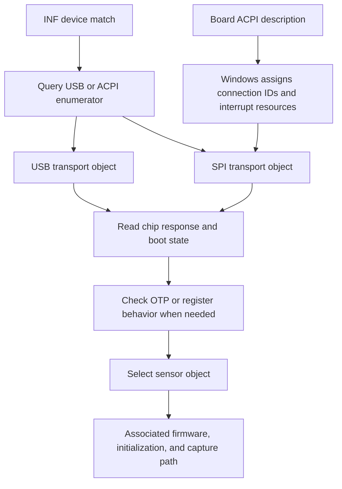

# How the Windows driver adapts to different hardware

[Documentation index](README.md)

Analysis date: 2026-10-04. Sample: AMD64 `ftWbioUmdfDriverV2.dll` from the same CAB as the two
preceding analysis steps. The accompanying INF declares package version `2.0.3.102`. The DLL is
1,515,192 bytes, with SHA-256:

`0a4eb56d843e1c3a2b64e37a1e41053e6f863b9dbd2626c59f7669c35dd55b10`

The DLL's own PE FileVersion / ProductVersion is `1.0.0.3188`; the INF package version must not be
substituted for the file version. Verification does not yet cover the complete lifecycle; see the
[coverage record](windows-lifecycle-coverage.md).

## Findings

**An INF without separate laptop-model branches still supports hardware adaptation. This DLL
separates adaptation into bus selection, board-resource binding, sensor detection, and
implementation selection.**

1. Query the Windows enumerator name and select a USB or SPI transport object.
2. On SPI, consume the connection and interrupt resources supplied by Windows and open the local
   SPI/GPIO connections through Resource Hub.
3. Determine sensor type from chip responses, application-firmware state, boot version, OTP, and
   related evidence.
4. Create a sensor-specific object whose associated firmware, initialization, and capture methods
   perform the operations.

These findings come from actual instructions, calls, comparisons, and data pointers. Log strings
only assist naming. The vendor DLL was not executed, no driver was installed, and no hardware was
operated. Original binaries and disassembly remain in a workspace outside the repository; this
document records only analytical facts and evidence locations.

The diagram shows the layers. Actual startup also branches for running firmware, absent application
firmware, special-chip probes, and recovery retries; not every device follows an identical sequence.

## Evidence-location conventions

All addresses below are **RVAs relative to the DLL image base**, not file offsets. This DLL's
preferred image base is `0x180000000`. PE `.pdata` supplies function ranges; Capstone 5.0.9 was used
for instruction decoding and pefile 2024.8.26 for PE mapping. Function labels derive from referenced
logs and call relationships, not vendor source code or a PDB.

## 1. Runtime bus selection

Within main entry `0x23D80`, `0x23DDF` calls `0x27C08` to query the device enumerator. The latter
queries property `0x0F` through WDF table entry `0xF8 / 8 = 31`. It then compares wide strings `USB`
and `ACPI` (string RVAs `0x43678`, `0x43680`) and sets internal bus value 1 or 2.

`0x23DF2` calls interface factory `0x23558`, whose two branches invoke USB constructor `0x3145C` and
SPI constructor `0x2DAB0`. The main entry then invokes hardware preparation through the selected
interface object.

WDF table indices and property meanings were checked against the
[UMDF 2.15 function enumeration](https://raw.githubusercontent.com/microsoft/Windows-Driver-Frameworks/main/src/publicinc/wdf/umdf/2.15/wdffuncenum.h)
and
[UMDF 2.15 type definitions](https://raw.githubusercontent.com/microsoft/Windows-Driver-Frameworks/main/src/publicinc/wdf/umdf/2.15/wudfwdm.h).
This is stronger evidence than simply finding `clsSpiDev` / `clsUsbDev` strings: the constructor
branches are connected to the startup entry.

## 2. Board wiring arrives through resource descriptions

SPI hardware preparation is at `0x2EB20`. Its verified behavior is:

| Evidence location | Actual behavior |
| --- | --- |
| `0x2EB9D`, `0x2EBFE` | Call WDF entries `0x5D0`, `0x5D8`, indices 186/187, for resource count and descriptor queries |
| `0x2EC38`, `0x2EC41` | Distinguish interrupt resource `Type=2` from connection resource `Type=0x84` |
| `0x2EC57–0x2EC62` | Connection `Class=2, Type=2` enters the SPI branch |
| `0x2ED43–0x2ED4E` | Connection `Class=1, Type=2` enters the GPIO I/O branch |
| `0x2EC7D–0x2ECC7` | Read the connection ID's low/high 32 bits and pass them to SPI-target creation at `0x303BC` |
| `0x2ED66–0x2EDB4` | Read the GPIO connection ID and pass it to GPIO-target creation at `0x2FF10` |
| `0x2EE1A–0x2EE6B` | Save the first interrupt resource's index and call interrupt creation at `0x301E8` |
| `0x2EF18–0x2EF2E` | Require SPI, GPIO, and interrupt resources; return `0xC0000225` if any are missing |

Constants and structure layouts agree with the
[Microsoft resource-descriptor documentation](https://learn.microsoft.com/en-us/windows-hardware/drivers/ddi/wdm/ns-wdm-_cm_partial_resource_descriptor)
and the UMDF headers above.

SPI/GPIO target creation at `0x30511–0x305F5` and `0x30065–0x30149` formats connection IDs into
Resource Hub device paths and calls WDF target creation/open methods. Interrupt creation uses the
same index to retrieve both raw and translated descriptors, then calls `WdfInterruptCreate` at index
72.

Here, Type=2 is a generic Windows interrupt resource; **the original ACPI does not have to use
GpioInt**. GPIO-based and ordinary Interrupt resources can both be delivered this way; see
[Microsoft's explanation](https://learn.microsoft.com/en-us/windows-hardware/drivers/gpio/gpio-based-interrupt-resources).
The examined creation path does not change descriptor flags to correct polarity. An earlier Linux
restriction to GpioInt was shown by the GPD report to block a real ordinary-Interrupt layout. The
current glue handles both resource forms through the shared IRQ interface; see
[current transport](acpi-spidev.md). Untraced resource-preparation, background-IRQ, and chip-power
behavior remains listed in [lifecycle coverage](windows-lifecycle-coverage.md).

**This resource-binding path needs to know resource roles, not A1 or GPD physical pin numbers
embedded in the INF.** Windows assigns connection IDs from the board's ACPI description. An ID
carries the controller, bus address, clock, and other connection parameters; the driver opens that
connection by ID. This matches the
[Microsoft SPB resource model](https://learn.microsoft.com/en-us/windows-hardware/drivers/spb/spb-peripheral-device-drivers)
and the DLL's behavior.

Adaptation is still constrained: the function selects the first matching SPI, GPIO I/O, and
interrupt resources and only logs later duplicates. The expected resource combination and roles must
match the board description. Without each model's ACPI tables, this analysis cannot establish every
machine's GPIO polarity, resource ordering, or controller mapping.

## 3. Detecting a specific sensor behind a shared hardware ID

### Actual SPI probe order

This sample does not send `70` universally before every chip probe. The main entry first calls the
dedicated FT9368 probe `0x26D9C` at `0x23FED`. If FT9368 is not selected, the SPI branch at
`0x2411C–0x24123` calls dedicated wake `0xFBA0`, then `0x10A74` for C6 configuration and dedicated
ID reading. If none of `9362/9365/9391/9392` matches, `0x2418B–0x241AE` first invokes the transport
hardware reset, waits an additional 10 ms, then repeats that wake and ID read. Full packets and the
evidence limits of C6 are documented in [special-family probing](special-probe.md).

Only after these special paths fail to select a chip does execution reach the legacy branch at
`0x24216`. Its outer retry counter begins at 0: round 0 skips legacy detection; round 1 performs the
running-firmware check below; rounds 2 onward directly take the no-running-firmware detection path.
The counter branch is at `0x24216–0x24221`, with increment and limit checking at `0x2428C–0x24299`.
This is the actual Windows control flow, not Linux's optimized discovery order. It does not make
legacy `70` a universal wake command for FT9368 or other special families.

### Path for running application firmware

This path does send software reset twice before reading `14/15`; it does not simply read the runtime
response first. The confirmed SPI sequence is:

| Step | Protocol fact | Evidence RVA |
| --- | --- | --- |
| Enter running-firmware check | Main entry calls `MultiCheckFWExist`, which calls `CheckFWExist` | `0x24221 → 0x28344 → 0x270E4` |
| Software reset | Send single-byte `70` in two separate SPI transactions, with 5 ms between them | `0x270EC → 0x28C54`; command mapping `0x22CEA`; single-byte transaction `0x2FCA2–0x2FCC7` |
| Check MCU status | Immediately after the second `70`, read two consecutive bytes from `20`; only `A5 5A` means idle | `0x270F6 → 0x2853C` |
| Bounded retry | Initial attempt plus at most 5 retries, 6 rounds total; each repeats both `70` commands and the status check, with another 5 ms between failed rounds | `0x28344–0x2839C` |
| Read runtime response | After the status check succeeds, main entry waits another 350 ms, then reads `14` and `15` separately | `0x2422A–0x24235 → 0x27290` |

`0x28C54` adds no wait after the second `70`; this detection chain inserts no 2 ms there either. The
A8 hardware-reset wrapper `0x39C50` adds 2 ms after calling the dual `70` helper
(`0x39D1B–0x39D20`). That is a different flow and must not be presented as a requirement of the
detection entry. These waits describe the sample's host behavior, not measured minimum chip timing.

`20/21` = `A5 5A` is MCU idle status; `14/15` is the runtime geometry response used for classification
below. They must not be called the same chip-ID pair. `CheckFWExist` treats a non-idle response as a
failed running-firmware check, but that does not prove RAM contains no firmware or that every chip
without loaded firmware returns `00 00` from `14/15`.

`0x27290` selects an internal sensor type from `14/15`; the main entry then calls the sensor factory
through `0x24720`. This classifier covers four legacy chips:

| Response bytes | Internal type | Factory-selected implementation |
| --- | ---: | --- |
| `58 58` | 1 | `clsFT9338` |
| `60 60` | 2 | `clsFT9348` |
| `40 50` | 3 | `clsFT9361` |
| `40 80` | 6 | `clsFT9536` |

Comparison branches are at `0x27312–0x27367`; actual constructor calls in `0x23690` verify the
type-to-object mapping.

This agrees with Linux's FT9361 `0x14/0x15 = 0x40/0x50` check. However, it is a **runtime response
used for identification**, not a proven immutable unique bare-silicon ID: the same DLL's
firmware-download path logs these two registers as sensor x/y. Unknown combinations in this
classifier also do not explicitly return an unknown-chip error, so this behavior should not be
copied unchanged as an ideal new specification.

### Path without confirmed running firmware

`0x24244` calls detector `0x27144`, which calls `0x283A4 → 0x2737C`. This path first identifies boot
version, then examines register behavior or OTP. It does not require loading the same FT9361
firmware to identify every chip.

- `0x28114` uses a `0x90`-related transfer to probe boot version; response byte `0xEF` selects
  branch A.
- Branch A calls `0x27414`, enters download mode, and accesses chip registers. Register `0xFE`
  readback distinguishes internal types 1 and 6. Specifically, `FE = 02` selects FT9536; the other
  branch defaults to FT9338 and must not be treated as positive FT9338 identity evidence.
- The other branch calls `0x2819C`, reads the response at `0x85C0`, and selects a subsequent
  detection route through OTP logic at `0x27650` or `0x278F4`.
- In `0x278F4`, the OTP low nibble, adjusted for the bus, selects type 2 for 1–3 and type 3 for 4,
  14, or 15; other values take the error path. Type 3 then maps to `clsFT9361`.

These are static control-flow facts, not a complete executable probing recipe. Bus framing,
prerequisite state, timing, and failure recovery require their own protocol specification and
hardware validation.

**Naming trap:** RegFile in `ft_feature_devinit_DistinguishByRegFile` refers to chip-register
access. The function actually reads and writes addresses such as `0xCB`, `0xFD`, and `0xFE` through
the transport object; it does not query the Windows registry in this function. Its name does not
reveal hidden per-model registry settings.

### Dedicated branches for other chips

The main entry also has FT9368 detection/recovery and SPI comparisons for `0x9362`, `0x9365`,
`0x9391`, and `0x9392` (`0x23FED–0x24185`, with retry comparisons at `0x241DA–0x24210`). These
select other internal types and implementations.

Hardware response, internal enumeration, and class name must remain distinct. For example, the
`0x9362` branch sets type 9 at `0x246DB`, while factory type 9 calls the `clsFT9369` constructor. A
log string listing seven sensor types also omits some factory branches and is not an authoritative
support table.

## 4. Sensor objects select firmware and operations

Factory `0x23690` dispatches as follows. This proves that implementations exist in the binary and
are referenced by this factory; it does not establish that every combination can bind through this
INF or has been validated on hardware.

| Internal type | Constructor RVA | Implementation label |
| ---: | --- | --- |
| 1 | `0x3574C` | `clsFT9338` |
| 2 | `0x35834` | `clsFT9348` |
| 3 | `0x35914` | `clsFT9361` |
| 4 | `0x35A94` | `clsFT9368` |
| 6 | `0x35C44` | `clsFT9536` |
| 9 | `0x35BA4` | `clsFT9369` |
| 11 | `0x35D24` | `clsFT9769` |
| 12 | `0x359F4` | `clsFT9365` |

FT9361 provides a reproducible example:

- Constructor `0x35914` sets its method table and writes the firmware pointer and length at
  `0x3593A–0x3595E`.
- Firmware pointer RVA `0x79160` corresponds to file offset `0x77960` = **489824**; length `0x289C`
  = **10396** bytes.
- Direct SHA-256 calculation over that range yields
  `027d776b0f4da0857037bbfe6bd114f52394061c67e8459528f9b2e30114e64f`, exactly matching the
  repository's expected FT9361 firmware hash. This step hashed the range without adding firmware to
  the repository.
- Firmware dispatcher `0x2C4A4` uses the already selected sensor object and calls different method
  slots according to boot version. FT9361's method table is at RVA `0x490B8`; its ordinary download
  slot points to `0x39730`.
- `0x39730` retrieves the object's firmware length and pointer at `0x3981D/0x39822` and passes them
  to the transport writer. This establishes a detection → object → specific firmware range →
  download-method chain, rather than just a firmware-byte or function-name match.

Firmware selection therefore occurs at DLL runtime. The INF need not list a separate `.bin` for
every sensor. Firmware associated with another 4 backends was located subsequently; see the
[complete inventory](windows-hardware-inventory.md). FT9361 firmware must not be applied to every
`FTE3600` device.

## 5. DLL hardware-ID logic extends beyond this INF

`0x27E14` queries the device HardwareID and compares string fragments including `9338`, `9536`,
`9348`, `93A8`, `7001`, `6100`, `3600`, and `4800`, setting scenario and algorithm-class state. The
`3600` branch sets scenario 1 and algorithm class 2, then still performs actual sensor detection.

These comparisons at `0x27F46–0x2802E` cannot be reconstructed into complete PnP IDs absent from
this INF or added to the confirmed support list. They show reusable DLL logic broader than this
package's INF. Whether it comes from shared builds, other OEM packages, or historical versions
requires cross-package analysis.

The verified main startup chain contains no located laptop-brand/model lookup that determines pins.
This is not a proof that every part of the entire package lacks OEM exceptions.

## Implications for libfprint

Subsequent implementation separates resource adaptation from chip protocol: ACPI-derived glue
exposes reset and IRQ resources, stock spidev handles SPI, and userspace detects the actual sensor.
The DMI model whitelist has been removed. There are now 8 sensor backends; the inventory and
protocol specifications document their identification, firmware authorization, and capture
parameters. Implementation is distinct from hardware validation. Firmware loading requires the
identity evidence appropriate to its path; not every `FTE3600` is an FT9361. See
[dynamic discovery](dynamic-discovery.md) and [current transport](acpi-spidev.md) for protocols,
resource constraints, and test limits.

GpioIo itself has no polarity field. Reset uses active-low semantics so logical `0/1/0` yields the
controller-level H/L/H sequence confirmed from Windows. If `_DSD` provides a reset property, it must
reference the same reset resource and declare active-low; conflicts are rejected before driving the
pin. A driver mapping is added only without that property. The exported GPIO layer forwards raw
levels to avoid double inversion, as explained in [GPIO polarity](gpio-polarity.md). Actual wiring
and waveform still require hardware confirmation. See the
[Linux ACPI GPIO documentation](https://www.kernel.org/doc/html/latest/firmware-guide/acpi/gpio-properties.html).

## Confirmed facts and remaining gaps

Comparison of 2.0.3.99, 2.0.3.100, and 2.0.3.102 confirmed 2 INF IDs in each sample. The older two
versions have 6 sensor backends in 4 operation groups; version 102 has 8 backends in 6 groups. 6 firmware ranges associated with 5 backends were located and are byte-identical across all three
samples. Complete counts, limits on the other 10 low-level IDs, version differences, and evidence
indices are in the [hardware and implementation inventory](windows-hardware-inventory.md).

Remaining gaps include each physical model's ACPI description and electrical polarity; complete
cold-start/recovery paths for every chip; all initialization tables and their semantics; every
OEM/historical version difference; and physical success rates for each branch. Eight software
backends do not determine the number of computer models, and static branch counts are not
compatibility certification.
