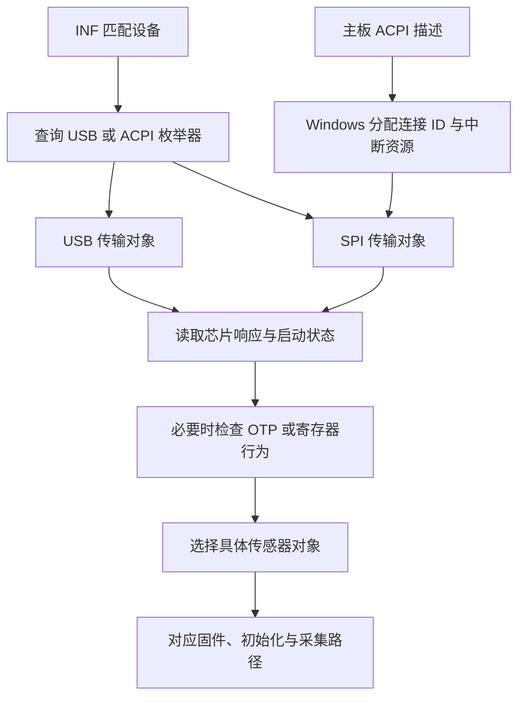

# Windows 驱动如何适配不同硬件

分析日期：2026-10-04。对象为前两步同一 CAB 中的 AMD64 `ftWbioUmdfDriverV2.dll`，版本来自配套 INF：`2.0.3.102`。DLL 大小 1,515,192 字节，SHA-256：

`0a4eb56d843e1c3a2b64e37a1e41053e6f863b9dbd2626c59f7669c35dd55b10`

## 结论

**没有按笔记本型号拆分 INF，不等于没有硬件适配。该 DLL 把适配分为总线选择、主板资源绑定、传感器识别和具体实现选择四层。**

1. 查询 Windows 枚举器名称，选择 USB 或 SPI 传输对象。
2. SPI 路径消费 Windows 传入的连接资源和中断资源，通过 Resource Hub 打开本机的 SPI/GPIO 连接。
3. 按芯片响应、运行固件状态、启动版本、OTP 等信息判断传感器类型。
4. 创建不同传感器对象，由对象关联的固件、初始化和采集方法完成操作。

这些结论来自实际指令、调用、比较分支和数据指针，日志字符串仅用于辅助命名。没有执行厂商 DLL、安装驱动或操作硬件。原始二进制及反汇编保存在仓库外的工作目录；本文只记录分析事实和证据定位。

图示表达分层关系；实际启动还有固件已运行、无运行固件、专用芯片探测及恢复重试分支，并非所有设备都经过完全相同的步骤。

## 证据定位规则

下文地址均为 **RVA（相对 DLL 映像基址）**，不是文件偏移。此 DLL 的首选映像基址为 `0x180000000`。PE 的 `.pdata` 提供函数范围，Capstone 5.0.9 用于指令解码，pefile 2024.8.26 用于 PE 映射。函数标签来自被实际引用的日志及调用关系，不是取得了厂商源码或 PDB。

## 1. 总线在运行时选择

主入口 `0x23D80` 中，`0x23DDF` 调用 `0x27C08` 查询设备枚举器；后者通过 WDF 表项 `0xF8 / 8 = 31` 查询属性 `0x0F`。随后分别比较宽字符串 `USB` 与 `ACPI`（字符串 RVA `0x43678`、`0x43680`），设置内部总线值 1 或 2。

`0x23DF2` 调用接口工厂 `0x23558`，其两个分支分别调用 USB 构造函数 `0x3145C` 和 SPI 构造函数 `0x2DAB0`。主入口随后通过选中的接口对象调用硬件准备方法。

WDF 表索引及属性含义分别对照 [UMDF 2.15 函数枚举](https://raw.githubusercontent.com/microsoft/Windows-Driver-Frameworks/main/src/publicinc/wdf/umdf/2.15/wdffuncenum.h) 和 [UMDF 2.15 类型定义](https://raw.githubusercontent.com/microsoft/Windows-Driver-Frameworks/main/src/publicinc/wdf/umdf/2.15/wudfwdm.h)。这比只看到 `clsSpiDev` / `clsUsbDev` 字符串更强：实际构造分支已连接到启动入口。

## 2. 主板接线通过资源描述传入

SPI 硬件准备函数位于 `0x2EB20`。可核实的行为如下：

| 证据位置 | 实际行为 |
| --- | --- |
| `0x2EB9D`、`0x2EBFE` | 调用 WDF 表项 `0x5D0`、`0x5D8`，即索引 186/187 的资源数量查询和资源描述符查询 |
| `0x2EC38`、`0x2EC41` | 区分中断资源 `Type=2` 和连接资源 `Type=0x84` |
| `0x2EC57–0x2EC62` | 连接 `Class=2, Type=2` 进入 SPI 分支 |
| `0x2ED43–0x2ED4E` | 连接 `Class=1, Type=2` 进入 GPIO I/O 分支 |
| `0x2EC7D–0x2ECC7` | 从描述符取连接 ID 低/高 32 位，传给 SPI 目标创建函数 `0x303BC` |
| `0x2ED66–0x2EDB4` | 从 GPIO 描述符取连接 ID，传给 GPIO 目标创建函数 `0x2FF10` |
| `0x2EE1A–0x2EE6B` | 保存第一个中断资源的索引，调用中断创建函数 `0x301E8` |
| `0x2EF18–0x2EF2E` | 检查 SPI、GPIO 和中断三类资源是否均已找到；缺少时返回 `0xC0000225` |

常量和结构成员布局与 [Microsoft 资源描述符文档](https://learn.microsoft.com/en-us/windows-hardware/drivers/ddi/wdm/ns-wdm-_cm_partial_resource_descriptor) 及上述 UMDF 头文件一致。

SPI/GPIO 目标创建函数分别在 `0x30511–0x305F5` 和 `0x30065–0x30149` 把连接 ID 格式化为 Resource Hub 设备路径，调用 WDF 目标创建/打开方法。中断创建函数使用同一索引取原始及转换后的描述符，再调用索引 72 的 `WdfInterruptCreate`。

**因此，在这条资源绑定路径中，驱动需要知道资源的用途，不需要把 A1 或 GPD 的物理引脚号写进 INF。** Windows 根据主板 ACPI 配置分配连接 ID；ID 隐含控制器、总线地址、时钟等连接参数，驱动通过该 ID 打开连接。这是 [Microsoft SPB 资源模型](https://learn.microsoft.com/en-us/windows-hardware/drivers/spb/spb-peripheral-device-drivers) 描述的机制，与本 DLL 的行为吻合。

适配也不是完全无约束：此函数使用首个符合条件的 SPI、GPIO I/O 和中断资源；后续同类资源只记录重复。它预期的资源组合和用途必须与主板描述一致。本次没有各机型 ACPI 表，尚不能确定每台机器对应的 GPIO 极性、资源顺序和控制器映射。

## 3. 同一硬件 ID 下仍会识别具体传感器

### SPI 入口的实际探测顺序

本样本没有在全部芯片探测之前统一发送 `70`。主入口先在 `0x23FED`
调用 FT9368 专用探测 `0x26D9C`；未选中 FT9368 时，SPI 分支在
`0x2411C–0x24123` 调用专用唤醒 `0xFBA0`，再调用 `0x10A74`
进行 C6 配置及专用 ID 读取。未命中 `9362/9365/9391/9392` 时，
`0x2418B–0x241AE` 先调用传输层硬件复位，额外等 10 ms，
再重复该专用唤醒和 ID 读取。该家族的完整报文及 C6 的证据边界见
[专用家族探测说明](special-probe.md)。

上述专用路径未选中芯片后，才到 `0x24216` 的 legacy 分支。
入口的外层重试计数从 0 开始：第 0 轮跳过 legacy 检测；第 1 轮
执行下述运行固件检查；第 2 轮起直接进入无运行固件的检测路径。
计数判断在 `0x24216–0x24221`，递增和上限检查在 `0x2428C–0x24299`。
这里记录的是 Windows 的实际控制流，不是 Linux 优化后的探测顺序；
不能据此把 legacy `70` 推广成 FT9368 或其他专用家族的通用唤醒命令。

### 已有运行固件的路径

这条路径在读取 `14/15` 之前确实发送两次软件复位命令，而不是直接读取
运行时响应。SPI 的已确认顺序如下：

| 步骤 | 协议事实 | 证据 RVA |
| --- | --- | --- |
| 进入运行固件检查 | 主入口调用 `MultiCheckFWExist`，后者调用 `CheckFWExist` | `0x24221 → 0x28344 → 0x270E4` |
| 软件复位 | 分两次 SPI 交易发送单字节 `70`，两次之间等 5 ms | `0x270EC → 0x28C54`；命令映射 `0x22CEA`；单字节交易 `0x2FCA2–0x2FCC7` |
| 检查 MCU 状态 | 第二次 `70` 返回后直接从 `20` 连读两字节；仅 `A5 5A` 判为空闲 | `0x270F6 → 0x2853C` |
| 有界重试 | 首次加最多 5 次重试，共最多 6 轮；每轮重新执行双 `70` 和状态检查，失败轮之间另等 5 ms | `0x28344–0x2839C` |
| 读取运行时响应 | 状态检查成功后，主入口再等 350 ms，然后分别读 `14`、`15` | `0x2422A–0x24235 → 0x27290` |

`0x28C54` 自身在第二次 `70` 后没有额外等待；该检测链也没有在这里
插入 2 ms。A8 硬件复位包装 `0x39C50` 在调用双 `70` 后另等 2 ms
（`0x39D1B–0x39D20`），那属于另一条流程，不能混写成检测入口的要求。
上述等待值是本样本的主机行为，不是经实测证明的芯片最短等待时间。

`20/21` 的 `A5 5A` 是 MCU 空闲状态，`14/15` 则是下面用于分类的
运行时几何响应；二者不能混称为同一组芯片 ID。`CheckFWExist` 将
非空闲状态视为运行固件检查未通过，但这不证明 RAM 中没有固件，
也不证明所有未加载固件的芯片都会在 `14/15` 返回 `00 00`。

`0x27290` 根据读取的 `14/15` 选择内部传感器类型；随后主入口经
`0x24720` 调用传感器工厂。此分类入口覆盖以下四种 legacy 芯片：

| 两个响应字节 | 内部类型 | 工厂选择的实现 |
| --- | ---: | --- |
| `58 58` | 1 | `clsFT9338` |
| `60 60` | 2 | `clsFT9348` |
| `40 50` | 3 | `clsFT9361` |
| `40 80` | 6 | `clsFT9536` |

比较分支位于 `0x27312–0x27367`；类型到对象的映射由 `0x23690` 的实际构造调用核实。

这与现有 Linux FT9361 的 `0x14/0x15 = 0x40/0x50` 检查一致。但这里应称为**用于识别的运行时响应**，不宜直接宣称是不可变的裸硅唯一 ID：同一 DLL 的固件下载路径将这两个寄存器的读数记录为 sensor x/y。该路径的未知组合也未显式返回“未知芯片”错误，不能原样当成理想的新实现规范。

### 无运行固件的路径

`0x24244` 调用检测入口 `0x27144`，继续调用 `0x283A4 → 0x2737C`。该路径先判别启动版本，再检查寄存器行为或 OTP，而不是必须先加载同一份 FT9361 固件才能识别所有芯片。

- `0x28114` 使用 `0x90` 相关传输探测启动版本，返回字节 `0xEF` 对应 A 分支。
- A 分支调用 `0x27414`，进入下载模式并访问芯片寄存器；根据 `0xFE` 的读回结果区分类型 1 与 6。
- 另一分支调用 `0x2819C`，读取 `0x85C0` 的响应，区分后续识别路径，再调用 `0x27650` 或 `0x278F4` 的 OTP 判别逻辑。
- 在 `0x278F4` 路径中，经总线条件修正后的 OTP 低四位为 1–3 时选类型 2，为 4、14、15 时选类型 3；其他值进入错误路径。类型 3 随后对应 `clsFT9361`。

上述是静态控制流事实，尚不是可直接执行的完整探测配方：总线编码、前置状态、时序和失败恢复仍需单独形成协议规范并做硬件验证。

**命名陷阱：** `ft_feature_devinit_DistinguishByRegFile` 中的 RegFile 指向芯片寄存器访问。函数实际通过传输对象读写 `0xCB`、`0xFD`、`0xFE` 等地址，没有在这段函数中查询 Windows 注册表；不能据此声称找到隐藏的机型注册表配置。

### 其他芯片的专用分支

主入口还有 FT9368 专用识别/恢复路径，以及 SPI 下针对返回 `0x9362`、`0x9365`、`0x9391`、`0x9392` 的比较分支（`0x23FED–0x24185`，重试后的比较在 `0x241DA–0x24210`）。这些分支会选择其他内部类型及实现。

必须区分“硬件响应”“内部枚举”“类名”三者：例如 `0x9362` 分支在 `0x246DB` 设置类型 9，而工厂类型 9 调用的是 `clsFT9369` 构造函数。日志中那条列举七种 sensor type 的文字也没有覆盖工厂全部分支，不能当作权威支持表。

## 4. 传感器对象选择决定固件和操作实现

工厂函数 `0x23690` 的实际分派如下。这里只证明二进制中存在并被该工厂引用的实现，不代表全部组合都能通过本 INF 加载或已通过实机验证。

| 内部类型 | 构造函数 RVA | 实现标签 |
| ---: | --- | --- |
| 1 | `0x3574C` | `clsFT9338` |
| 2 | `0x35834` | `clsFT9348` |
| 3 | `0x35914` | `clsFT9361` |
| 4 | `0x35A94` | `clsFT9368` |
| 6 | `0x35C44` | `clsFT9536` |
| 9 | `0x35BA4` | `clsFT9369` |
| 11 | `0x35D24` | `clsFT9769` |
| 12 | `0x359F4` | `clsFT9365` |

以 FT9361 为可复核实例：

- 构造函数 `0x35914` 设置自身方法表，并在 `0x3593A–0x3595E` 写入固件指针及长度。
- 固件指针 RVA `0x79160`，对应文件偏移 `0x77960` = **489824**；长度 `0x289C` = **10396** 字节。
- 对该范围直接计算 SHA-256，得到 `027d776b0f4da0857037bbfe6bd114f52394061c67e8459528f9b2e30114e64f`，与仓库现有 FT9361 固件期望值完全一致。此次只计算范围哈希，没有将固件加入仓库。
- 固件分派函数 `0x2C4A4` 使用已经选定的传感器对象，并按启动版本调用不同方法槽。FT9361 的方法表 RVA 为 `0x490B8`；其中普通下载槽关联 `0x39730`。
- `0x39730` 在 `0x3981D/0x39822` 取出该对象的固件长度与指针，交给传输层写入。因此这里已经形成“识别 → 对象 → 指定固件范围 → 下载方法”的证据链，而非仅搜到固件字节或函数名。

这说明固件选择发生在 DLL 运行时。INF 不需要为每种传感器列出不同的 `.bin` 文件。后续已定位另外 4 个后端关联的固件，见[完整清单](windows-hardware-inventory.md)；不能把 FT9361 固件套到所有 `FTE3600` 设备上。

## 5. DLL 中的硬件 ID 逻辑比此 INF 更宽

`0x27E14` 查询设备 HardwareID，并比较 `9338`、`9536`、`9348`、`93A8`、`7001`、`6100`、`3600`、`4800` 等字符串片段，设置场景和算法类别状态。`3600` 分支设置场景 1、算法类别 2，之后仍进行真实传感器检测。

这些字符串比较位于 `0x27F46–0x2802E`，不能还原成不存在于本 INF 的完整 PnP ID，更不能将它们补写为已确认受支持硬件。它们表明 DLL 内含比此分发包 INF 更广的复用逻辑；是否来自共享构建、其他 OEM 包或其他历史版本，仍需跨包比较。

在已经核实的主启动链中，未发现按笔记本品牌/型号查表来决定引脚的步骤。这不是对整个驱动包所有代码作出的“绝无 OEM 特例”证明。

## 对 libfprint 扩展的影响

后续实现已把资源适配与芯片协议分开：内核桥接层从 ACPI 获取 SPI/GPIO/IRQ，
用户态探测真实传感器；DMI 机型白名单已移除。当前只实现 FT9361 后端，
加载固件前还要求 ROM 家族及 OTP 检查，不能把所有 `FTE3600` 都当作 FT9361。
具体协议、资源约束和测试边界见 [动态发现说明](dynamic-discovery.md)。

GpioIo 本身没有极性字段。当前 reset 使用已知的 active-low 约定，允许
`_DSD` 的 `reset-gpios` 属性优先指定；这项板级假设仍需实机确认。
参考 [Linux ACPI GPIO 文档](https://www.kernel.org/doc/html/latest/firmware-guide/acpi/gpio-properties.html)。

## 已证实与尚待确认

进一步比较 2.0.3.99、2.0.3.100、2.0.3.102 后，已确认：三个样本均有 2 个 INF ID；
旧两版为 6 个传感器后端、4 组操作方法，102 版为 8 个后端、6 组；
5 个后端关联的 6 段固件已定位，且在三个样本中逐字节相同。
完整计数、另外 10 个底层 ID 的适用边界、版本差异及证据索引见
[硬件与处理逻辑清单](windows-hardware-inventory.md)。

仍未确认：每台实际机型的 ACPI 描述和电气极性；全部芯片的完整冷启动/恢复路径；
所有初始化表及其语义；全部 OEM/历史版本差异；每条分支的实机成功率。
不能从 8 个软件后端推导整机型号总数，也不能把静态分支数量当成兼容性认证。
